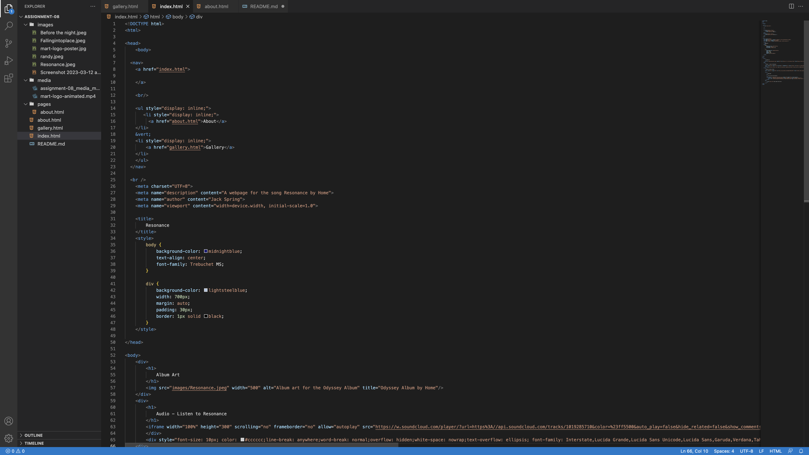

1. It was a bit difficult to learn and overwhelming however I found some good resources and was able to solve the many issues that came up.
2. I'm terribly anxious to start a new coding language, especially when I feel still pretty new to HTML. However, I am excited to learn about making our websites have more personal design.

