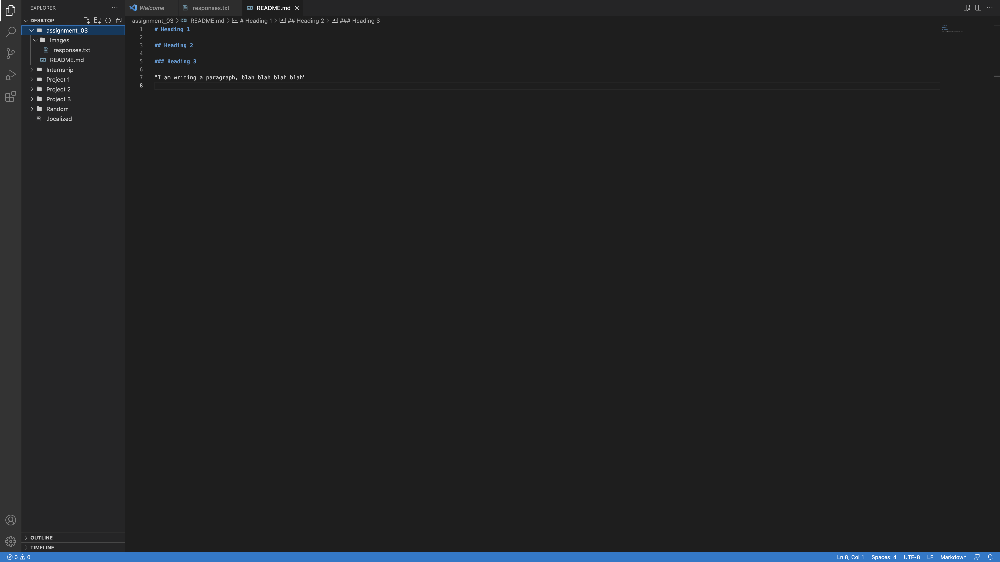

# Assignment Questions

## I've learned the entire worlds internet can be destroyed by simply cutting the fiber optic cables that connect countries from the bottom of the ocean. It is a little terrifying to come to the realization our entire society could be wiped out by simply cutting these lines.

## I learned that fiber optic cables actually are made of glass threads that reflect light in different ways in order to send bits at extremely high speed and can send multiple at a time, because each bit can reflect down the thread in a different way.

## I learned that there is a difference between the internet and the worldwide web. The internet is like the highway and railroads for the pages you see on the worldwide web. 

"I am writing a paragraph, blah blah blah blah"

[Click Here](https://zoomquilt2.com)

[My File](./responses.txt)

